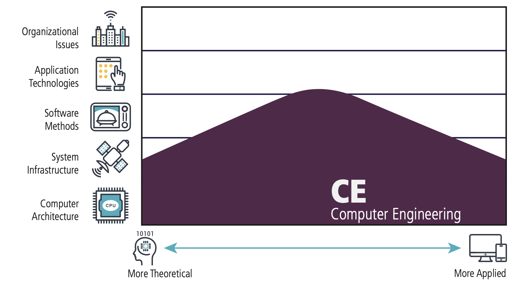
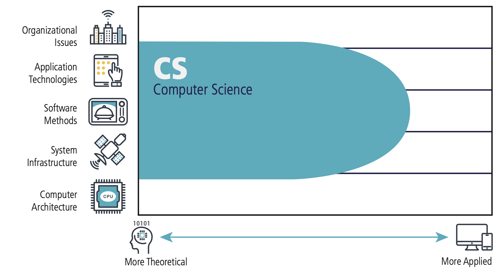
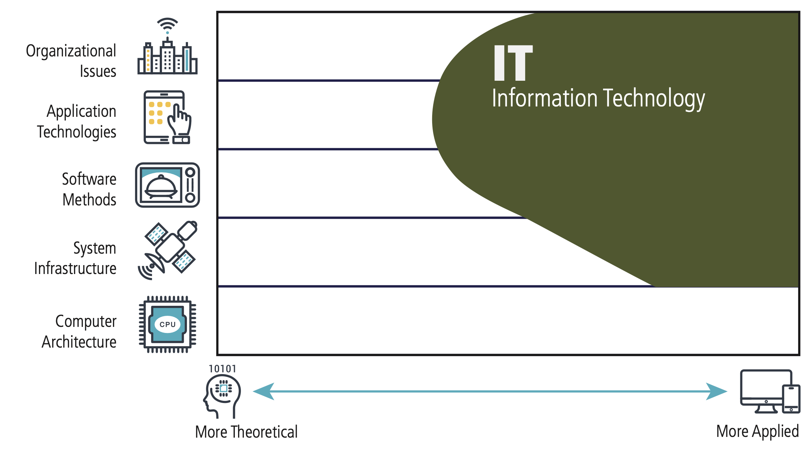
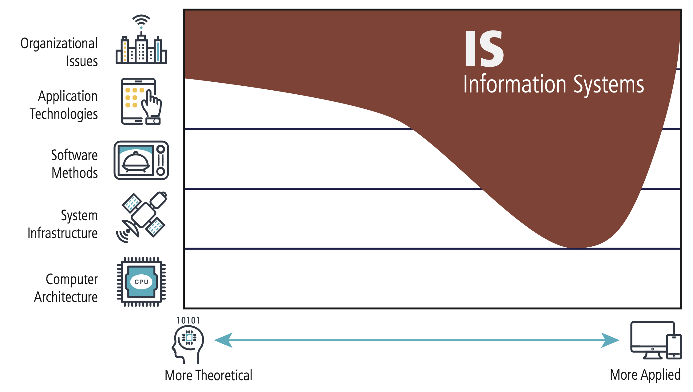
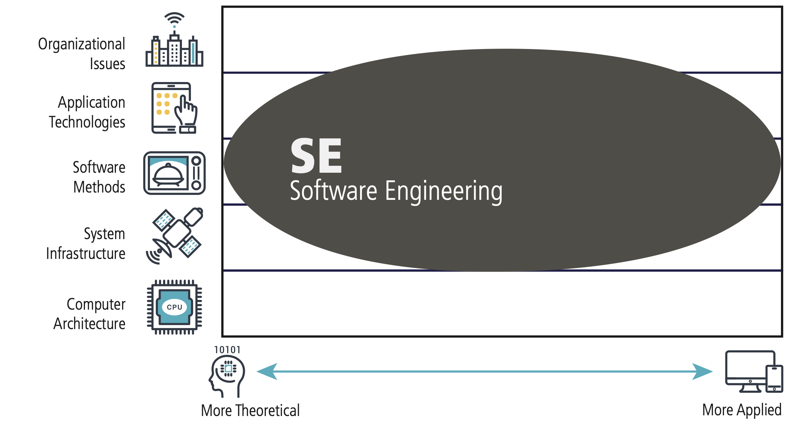

# COMPUTER SCIENCE AS A DISCIPLINE.

## Introduction to Computer Science

- The study of **computers**, **computational systems**, and **automated computation**.
- Computer science became a discipline in the _early 1940s_.
- The field evolved through the establishment of theoretical foundations by many important historical pioneers, the invention of early computers, and the development of programming languages that formalized software development, solidifying computer science as a distinct discipline (Denning, 1999).
- This discipline is frequently described as the systematic study of algorithmic processes that describe and transform information.
- The fundamental question underlying all of computing is:

> What can be (efficiently) automated?

- By the early 1960s, there was a sufficient body of knowledge to merit the first academic departments and degree programs. This discipline is also called **computer science** and **engineering**, **computing**, and **informatics** (Denning, 1999).

## An Overview of the 5 Computing Disciplines and Majors

- Although being a very new discipline, computing has expanded rapidly over the past few decades. Where it gave birth to multiple disciplines and majors. Which are:

| 5 Computing Disciplines and Majors |
| ---------------------------------- |
| Computer Engineering               |
| Computer Science                   |
| Information Technology             |
| Information Systems                |
| Software Engineering               |

### Computer Engineering

- Computer Engineers are focused on the connection between **hardware** and **software**. The emphasis and concern lies with the _design and construction of computers and embedded systems_.
- Computer Engineers apply engineering theories to the problems of designing computers and computer-based devices. This is a _theory-driven practice which incorporates traditional engineering and mathematics_.
- Compared to the other Computing Disciplines, Computer Engineering gives the most emphasis on Hardware, _specifically computer architecture and infrastructure_, from the applied to the theoretical aspects.

### Computer Science

- Computer Science develop a strong foundation based on **mathematics** and **algorithms**. This program spans the range from _theories through programming to cutting-edge development of computing solutions_.
- This is a program that focuses on the study of **algorithms**, **programming**, **data structures**, and **computational theory**, equipping students with the _skills to design, develop, and optimize software and hardware systems_.
- It focuses and gives most emphasis on the _theoretical aspects of computing_, which aids computer scientists the use of mathematical approaches to invent and improve new algorithms.

### Information Technology

- Information Technology (IT) professionals _provide customer service with a focus on technology_. They are responsible for planning and managing the entire technology lifecycle.
- This program aids students with experience in **both hardware and software** which prepares them to meet the technological needs of businesses and organizations of the real world.
- IT professionals _possess both knowledge and practicality_, hands-on expertise to take care of both an organization’s technological infrastructure and the people who use it.

### Information Systems

- Information Systems specialists integrate computing knowledge and expertise with **business processes**. They focus on the _processing of information, and must have a solid foundation of how organizations and technology work_.
- This discipline’s perspective on _information technology emphasizes information, and views technology as an instrument for generating, processing, and distributing information_.
- This program aids students in becoming an **effective bridge** between the management and technical communities within an organization.
- Information Systems is focused on the organizational issues of computing and technology. Information Systems also has an interest in the _applied aspects of application technologies and software development_.

### Software Engineering

- Using the principles of **mathematics** and **computer science**, and the **practices of engineering**, _software engineers effectively develop and maintain large-scale software systems_ that meets customers’ needs.
- Software Engineering students learn about software _reliability and maintenance_, and _focus more on the best techniques in writing software_ for engineering software applications.
- Software engineering is the systematic application of engineering principles to the design, development, testing, and maintenance of software, aiming to _create reliable_, _efficient_, _and scalable software solutions_.

## Reaction/Analysis

The world of Computer Science (CS) has become one of the most thrilling disciplines of our
time. Despite being relatively new compared to other established fields and its immense
potential to change our future. CS has 5 computing disciplines and majors: computer
engineering, computer science, information technology, information systems, and software
engineering. Although these programs share a lot in common, each has different roles and
purposes within the field. Being well-versed in the differences is an important aspect of
appreciating their unique contributions not only to this field but how it can rapidly change the
future.

Computer Engineering emphasizes more on the connection between hardware and
software. The emphasis and concern lies with the design and construction of computers and
embedded systems. This is a theory-driven practice that incorporates traditional engineering
and mathematics. On the other hand, Computer Science, being the most popular on the list,
aims to develop a strong foundation based on mathematics and algorithms. This program spans
the range from theories through programming to cutting-edge development of computing
solutions.

Information Technology aims to aid students with experience in providing customer service
which focuses on software and hardware. IT professionals possess both knowledge and
practicality, hands-on expertise to take care of both an organization’s technological
infrastructure and the people who use it. While Information Systems specializes in integrating
computing knowledge and expertise with business processes. These two computing disciplines,
are a more specified discipline, in the context of real-world applications where students are
prepared to meet the technological needs of businesses and organizations of the real world.

Software Engineering emphasizes the application of mathematics, computer science, and the
practices of engineering. Software engineers effectively develop and maintain large-scale
software systems that meet customers' needs. Software Engineering students learn about
software reliability and maintenance and focus more on the best techniques in writing software
for engineering software applications

## References

- Computing Disciplines & Majors. (n.d.-a). https://tinyurl.com/mswxnn8f
- Connolly, R., MIller, J., & Uzoka, F.-M. (2017). Computing disciplines: A quick guide for prospective students and career advisors. CERIC.
- Denning, P. J. (1999, July). Computer science: The discipline - the denning institute. Computer Science: The Discipline. https://denninginstitute.com/pjd/PUBS/ENC/cs99.pdf
- Quality Criteria’s of computing disciplines. (n.d.-b). https://tinyurl.com/2ddrvk7c
- University, S. M. S. (n.d.). Computer science: Disciplinary perspective. Computer Science: Disciplinary Perspective | English 251 Open Textbook | Southwest Minnesota State University. https://tinyurl.com/3b55mhup
- What distinguishes each of the major computing (n.d.-c). https://www.laccei.org/LACCEI2008-Honduras/Papers/CD092_Lunt.pdf
- When did computer science start?. Noodle.com. (2024, March 26). https://resources.noodle.com/articles/when-did-computer-science-start/
