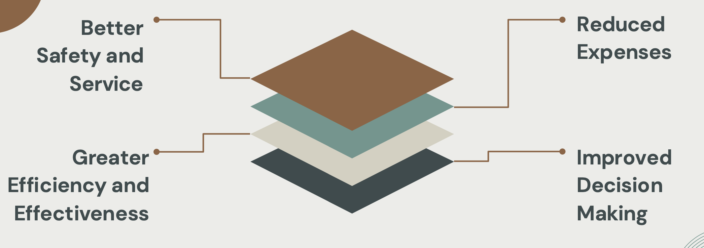
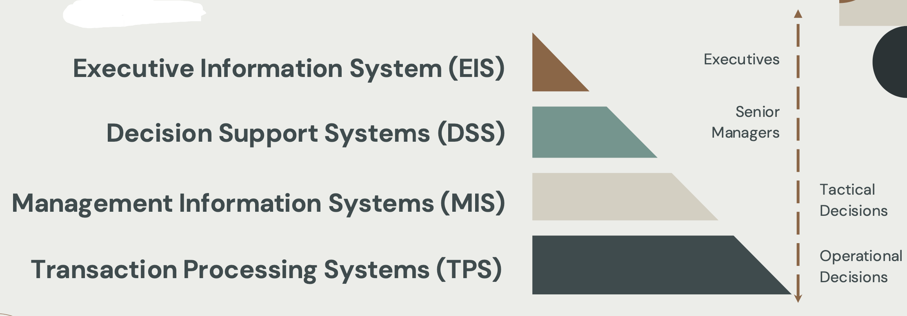

# DATA INFORMATION & INFO SYSTEMS.

## Data vs Information

### Data

- Data are **raw facts**, **events**, **numbers**, and **transactions**, which have been collected, recorded, _stored but are not yet processed_.
- Data may consist of _numbers and characters_ which are used to record facts and events about activities occurring in an environment.

#### Examples

- The number of visitors to a website in one month.
- Inventory levels in a warehouse on a specific date.
- The price of competitor's products.

### Information

- Information is **processed data**.
- It is obtained after processing data, in which **gives data a meaning and context**, that is useful for decision-making or communication.

#### Examples

- Understanding that changes to a website have led to an increase or decrease in monthly site visitors.
- Identifying supply chain issues based on trends in warehouse inventory levels over time.
- Determining if a competitor is charging more or less for a similar product.

| Data                                                                                 | Information                                                                                   |
| ------------------------------------------------------------------------------------ | --------------------------------------------------------------------------------------------- |
| Data on its own has _no meaning_                                                     | When data is given a meaning or context, _it provides information_.                           |
| Data is raw, unorganized facts or numbers that represent conditions ideas or objects | When Data is processed into information, it _becomes interpretable_ which gains significance. |

> Information is useful data; it provides answers to questions: "who", "what", "where", and "when"
>
> ~ (Ackoff, 1989)

# DATA + Meaning = Information

## Information Systems

> "Information Systems are data becoming information in consciousness; organizations are socially constructed through language, and our reasoning about both these processes takes place in dialogue."
>
> ~ Boland, 1985

### Information (IS)

- An information system is an _integrated and cooperating set of software_ directed information technologies supporting individual, group, organization, or societal goals.
- IS is a set of interrelated components that _collect, manipulate, store, and disseminate information, and provide a feedback mechanism_ to meet an objective.
- Arrangement of **people**, **data**, **processes**, **interfaces**, **networks** and **technology** that _interact to support and improve both day-to-day operations in a business_ as well as support the _problem-solving and decision-making_ needs of management.

### An Information System can be:

| Computerized                                                                                                      | Manual                                                                         |
| ----------------------------------------------------------------------------------------------------------------- | ------------------------------------------------------------------------------ |
| **Example**: Using program trading to track the market and trade large blocks of stocks when discrepancies occur. | **Example**: Developing pattersn and trends on graph paper for stock analysis. |

### The Role of Information Systems

## Types of Information Systems

- Four level pyramid model based on the type of decisions taken at different levels in the organizations.
  

### Transaction Processing Systems (TPS)

- Transaction Processing System are **operational-level systems** at the bottom of the pyramid.
- It is an information processing system that _captures and processes every single transaction_ that takes place within the organization.

#### Importance of TPS

| Handling and Managing Operations | An excellent Technology in handling and managing the everyday operations for any given organizations.                 |
| -------------------------------- | --------------------------------------------------------------------------------------------------------------------- |
| Tapping the Raw Markets          | This gives businesses an opportunity to tap, exist, and grow in never markets that are raw and full of opportunities. |

#### Functions of TPS

| Input Functions                                                           | Processing Functions                                                                | Output Functions                                                                    |
| ------------------------------------------------------------------------- | ----------------------------------------------------------------------------------- | ----------------------------------------------------------------------------------- |
| Securing and inputting the data of the transactions that have take place. | Computing, calculating, sorting, and defining the input to get the desired results. | Producing the report and record of the input data to be used for the other systems. |

### Management Information Systems (MIS)

- MIS is a formalized computer information system that can **collect**, **store**, **process** and **report** data from various sources _to provide the information necessary for managerial decision making_.
- A systematic approach to _gathering information from the TPS_, organizing it, and presenting it in a clear format _to aid business leaders in making strategic decisions_.

#### The Role of MIS

| Instrumental in Supporting Decision Making | Efficient decision-making hinges on the availability of fast, accurate, and high- quality information, often requiring competent staff to manage it effectively. |
| ------------------------------------------ | ---------------------------------------------------------------------------------------------------------------------------------------------------------------- |
| Facilitates the Flow of Information        | Ensures that managers at all levels can make effective decisions.                                                                                                |

### Decision Support Systems (DSS)

- An Information System _intended to help decision makers compile useful information_ from a combination of **raw data**, **documents**, or **business models** to identify and solve problems, and make decisions.
- An Information System that _combines data and mathematical models to help decision makers solve complex problems_ faced in managing the public and private enterprises and organizations.

#### The Role of DSS

| Makes Workflow more Efficient      | Can help to reduce errors and make workflow more efficient. By reducing the time needed to make important decisions, decision support systems can streamline the process. |
| ---------------------------------- | ------------------------------------------------------------------------------------------------------------------------------------------------------------------------- |
| Helps with Planning and Management | Offers precise plans for implementing procedures based on their data, making it simpler for professionals to correct mistakes or start new processes.                     |

### Executive Information System (EIS)

- An EIS provides key information, gathered from the other types of information systems, to senior executives and managers.
- It is designed to **facilitate** and **support** the _information and decision-making_ needs of senior executives.

#### The Role of EIS

| Easy Access, User-friendly    | It provides executive information in a readily accessible, interactive format using graphics-based queries on summarized and detailed data. |
| ----------------------------- | ------------------------------------------------------------------------------------------------------------------------------------------- |
| Determines Potential Outcomes | By evaluating past data, the system can make educated predictions about how a decision may impact the organization or client.               |

## Reaction/Analysis

Data vs Information, before crafting this portfolio, I thought these two could be changed interchangeably, but I needed to be corrected. Data on its own has no meaning, it is raw and unorganized to which represent ideas or objects, characters or numbers. When given a meaning or context, in away it becomes interpretable and gains significance, and we call that Information. Through the equation by one of the authors cited in the portfolio, Data + Meaning = Information, makes understanding both terms with ease. According to Ackoff, Information is useful data; it provides answers to the questions: who, what, where, and when.

When Data becomes Information, and that Information gains consciousness in the sense that it plays a significant role in businesses or organizations, it becomes Information System (IS). IS is a set of interrelated components that collect, manipulate, store, and disseminate information, and provide a feedback mechanism to meet an objective. This is an integrated and cooperating set of software-directed information technologies supporting individual, group, organization, or societal goals. This system can be computerized or manual, where a computerized information system emphasizes efficiency.

There are different levels of information systems that are based on the type of decisions taken at different levels in the organizations, starting at the bottom of the pyramid model to the top: Transaction Processing Systems (TPS), Management Information Systems (MIS), Decision Support Systems (DSS), and finally, Executive Information System (EIS).

Understanding the roles of the different levels of Information Systems, allows us to appreciate their significance in businesses or organizations. When done correctly and efficiently, their capability to improve workload and business outcomes is amazing. A few of its primary roles are Better Safety and Service, Reduced Expenses, Greater Efficiency and Effectiveness, and Improved Decision Making. In addition to this, efficient use of these information systems can lead to increased productivity and reduced error, enhanced data analytics capabilities that enables organizations to predict and adapt trends.

## References

- 18MCO25E - IV unit a transaction processing system TPS ... (n.d.-a). https://tinyurl.com/4b9b8y5u
- Ackoff, R. L. (1989). From Data to Wisdom. Journal of Applied Systems Analysis, 16.
- Azad, M. M., Amin, M. B., & Alauddin, M. (2012). Executive Information System, 12(5).
- Chapter 3 data, information and meaning. (n.d.-b). https://tinyurl.com/yuj9jhs5
- Creps, W. B., & O’Leary, D. E. (1994). Executive Information Systems . Executive Information Systems.
- Data and information. (n.d.-c). https://tinyurl.com/36kxck4p
- Decision support system (DDS): Definition, benefits and types | indeed.com. (n.d.-d). https://tinyurl.com/mwya2h6e
- Figure 1: Information system pyramid. (n.d.-e). https://tinyurl.com/5dfj5wcd
- Fundamentals of Information Systems, Fifth Edition. (n.d.). . Course Technology: Cengage learning. https://tinyurl.com/yz5bvec8
- Imran, M. (2014, November 23). Explain the functions of EIS or ESS according to the organizational units? the role of Eis & Ess in the organization. Academia.edu. https://rb.gy/5mdui9
- Jain, R. (2016). Decision Support Systems: An Overview.
- Jain, S. (2024, July 16). What is data vs. what is information. Bloomfire. https://bloomfire.com/blog/data-vs-information/
- Jaiswal, R. C. (2023). The Role of Management Information Systems in Organizations.
- LCWU. (n.d.-f). https://rb.gy/z6jyay
- Management Information Systems (MIS) – types, features, functions - shiksha online. Study in India. (n.d.). https://tinyurl.com/3tp9ytry
- Scribd. (n.d.-a). Data, information and knowledge. Scribd. https://tinyurl.com/mrxpn3m3
- Scribd. (n.d.-b). Executive information system. Scribd. https://tinyurl.com/2x3ecbz2
- Scribd. (n.d.-c). Functions of MIS. Scribd. https://tinyurl.com/nbxvb35w
- Shalabi, R. (2020). THE IMPORTANCE AND APPLICATIONS OF DECISION SUPPORT SYSTEMS (DSS) IN HIGHER EDUCATION. https://doi.org/10.6084/m9.figshare.12465599.v1
- Sharma, V. (n.d.). Types of Information Systems.
- Stair, R. M., & Reynolds, G. W. (2018). Fundamentals of Information Systems. Cengage Learning.
- Topic 1.1 data, information and knowledge. (n.d.-g). https://tinyurl.com/yds2jkas
- Unit-1 Chapter 2: Decision support system. (n.d.-h). https://tinyurl.com/ymj2rtsv
- Watson, H. J., Rainer, R. K., & Koh, C. E. (1991). Executive Information Systems: A framework for development and a survey of current practices. MIS Quarterly, 15(1), 13. https://doi.org/10.2307/249431
- Zemmouchi-Ghomari, L. (2022a). Basic Concepts of Information Systems. Contemporary Issues in Information Systems - A Global Perspective. https://doi.org/10.5772/intechopen.97644
