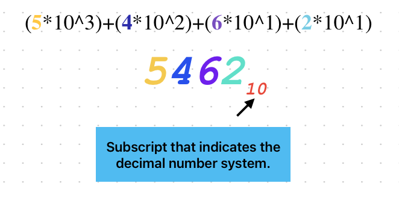
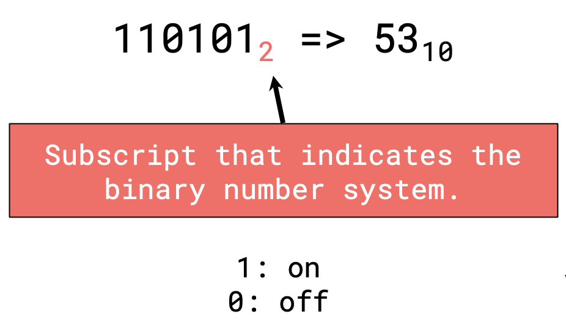
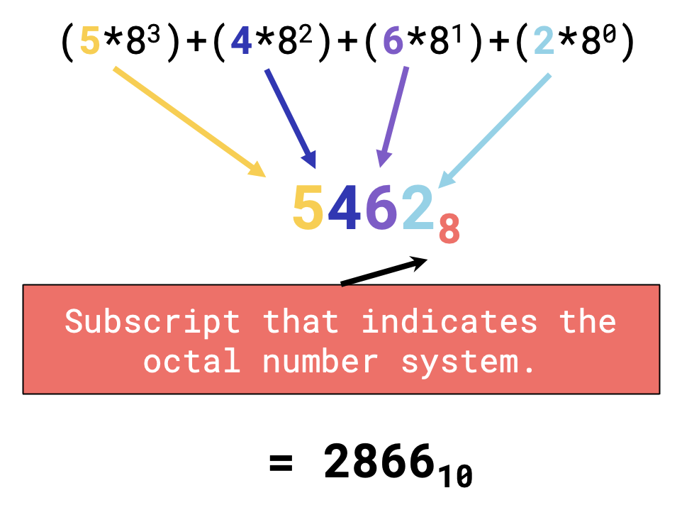
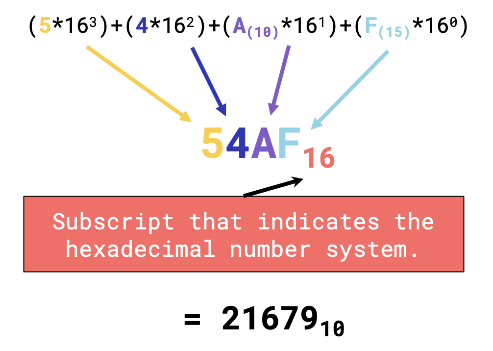

# NUMBER SYSTEMS.

## What are Number Systems

> A number system in computer ideology is regarded as the method or system of numbering and representing digits in the computer ‘inner’ system.
>
> ~ Olajide, 2017

- is a _set of rules and symbols_ used to represent a number, or any system used for naming or representing numbers (Latif et al., 2011).
- A **number system** defines how a number can be _represented using distinct symbols_ (Chiang, 2010).
- are the technique to _represent numbers in the computer system architecture_, every value that you are saving or getting into/from computer memory has a **defined number system**.
- _A system of writing to express numbers_. A number system is a mathematical system with base **n**, where **n** represents total numbers present in that system.

## Types of Number Systems

### Decimal [10]

- “Decem” in latin, means **ten**.
- `Utilizes 10 Symbols: -> { 0, 1, 2, 3, 4, 5, 6, 7, 8, 9 }`

### Binary [2]

- “Binarius” in latin, means **two**.
- BIT: a binary digit
- BYTE: (typically)8 bits
- `Utilizes 2 Symbols: -> { 0, 1 }`

### Octal [8]

- "Octo" in latin, means **eight**.
- `Utilizes 8 Symbols: -> { 0, 1, 2, 3, 4, 5, 6, 7 }`

### Hexadecimal [16]

- "hex" in Greek, means **six**.
- "decem" in latin, means **ten**.
- `Utilizes 16 Symbols: -> { 0, 1, 2, 3, 4, 5, 6, 7, 8, 9, A, B, C, D, E, F }`

## Purpose of each Number System

- **Computers** are a man made creation, but they work on the _language of numbers_. When we type a letter, number or special character on a computer, the operating system _converts the input into numbers_. This is because _computers can only understand the positional number system_ in which there are some symbols that are called **digits**. The symbols used in the number system depict varying values.

### Decimal

- Considered to be the **default number system** _most commonly used in everyday life_.
- The number system used for **counting** and **arithmetic**.

### Binary

- A way of representing data using **0**s and **1**s. This system is _used by computers to represent all the data it works with_. **0 = off; 1 = on**
- A **lightweight system** that _can represent any value or complex data_.

### Octal

- The primary characteristic of an **octal number system** is that it has _8 different counting digits from 0 to 7_. In the early computing days, octal numbers and the octal numbering system counted inputs and outputs. **The octal number was introduced to convert large binary numbers easily**.
- Because of its relationship with the binary system, it is _useful in programming some types of computers_.

### Hexadecimal

- As we know, computers can only deal with 2 numbers **(0 and 1)**. The problem for computer scientists is that very quickly, **a fairly small number like 258 (3 digits long) becomes the massive binary number of 100000010 (9 digits!)**. To solve this issue, computer scientists came up with another number system to _help them deal with base two numbers (binary) but without the long string of digits_!

## Reaction/Analysis

Computers are truly amazing, these machines are what we consider to be the future. From automating the simplest tasks to the most complex ones, these machines are the solution and can lead us into a much more innovative future. Through this, understanding the fundamentals of computers, and what and how they work, allows us to harness the capabilities of what computers can offer. Computers have revolutionized nearly every aspect of our lives, becoming very important assets ranging from healthcare, businesses, and even education. With their ability to process information within the blink of an eye that would have otherwise taken years or even decades to solve manually.

Understanding the core fundamentals of what makes computers, computers empowers us to harness the power and the potential of technology. Starting from how they are able to process inputted data and make an accurate outputs, it's important to be knowledgeable about how computers understand their developers and programmers. Through various systems, such as the Number Systems, allow such communication to happen. Everything in a computer, whether it's texts, images, sound, or complex algorithms, they’re represented as numbers. Being knowledgeable about the different types of numbering systems allows us to program and develop these machines more efficiently. Number systems such as the Decimal, Binary, Octal, and Hexadecimal.

The Decimal Number System is considered to be the most commonly used in our everyday life. This is the numerical system that we utilize in counting and arithmetic. The Binary Number System is considered to be the most lightweight as it only utilizes the values: one (1) and two (2). The purpose of this system is to allow computers to efficiently process data and information.

Binary numbers, while it is lightweight and efficient, can quickly become long and difficult to interpret. Utilizing a higher number system, such as the Octal and Hexadecimal Number Systems, allows lengthy binary values to be more concise. For instance, a fairly small number like 258, in binary is 100000010, which is 3 times its original length. Utilizing octal and hexadecimal number systems, then that number will be 402 and 102, respectively.

## References

- Alkadhem, Z. (n.d.). Introduction To Number Systems. Introduction_to_number_systems_1.pdf. https://rb.gy/lgkjc7
- Alshehri, H. (n.d.). KSU. https://rb.gy/sh6i6x
- Carnegie Mellon University. (n.d.). Introduction to binary. Introduction to Binary. https://tinyurl.com/yw59pbvk
- Chiang, T.-C. (2010). Number System. Microsoft PowerPoint - 1_Number Systems-. https://www.uobabylon.edu.iq/eprints/publication_3_8400_6187.pdf
- Computer Science UK. (n.d.). The hexadecimal number system. https://tinyurl.com/yc6xkuj6
- DIGITAL ELECTRONICS NCK Notes. (n.d.). Newcollege. UNIT 1 : NUMBER SYSTEM & BINARY CODES . https://tinyurl.com/49j53cea
- Digital Electronics Number System. (n.d.-a). https://tinyurl.com/mfkm2nvb
- Harle, R. (n.d.). Computer Fundamentals: Number Systems. iitmanagement. (n.d.). Iitmanagement. NUMBER SYSTEMS & BOOLEAN ALGEBRA. https://tinyurl.com/nhf5p8h9
- Latif, S., Qayyum, J., Lal, M., & Khan, F. (2011). Novel approach to the learning of various number systems. International Journal of Computer Applications, 26(7), 18–28. https://doi.org/10.5120/3116-4283
- Maini, A. K. (2008). Digital Electronics: Principles, devices and applications. John Wiley & Sons.
- Number system.pdf. (n.d.-b). https://www.ipsgwalior.org/download/number%20system.pdf
- Olajide, A. O. (2017). Number System. https://doi.org/10.13140/RG.2.2.18838.04167
- Priceton University. (n.d.). Number Systems and Number Representation. https://tinyurl.com/4syezxkx
- SNS courseware. SNS Courseware. (n.d.). https://snscourseware.org/
- thevbprogrammer.com. (n.d.). Number systems tutorial. NUMBER SYSTEMS CONCEPTS. https://tinyurl.com/49wp5kkz
- VERMA, V. K., KANPUR, K. O., & BHARDWAJ, S. (n.d.). Decimal number system. Number Systems. https://tinyurl.com/24jfajya
