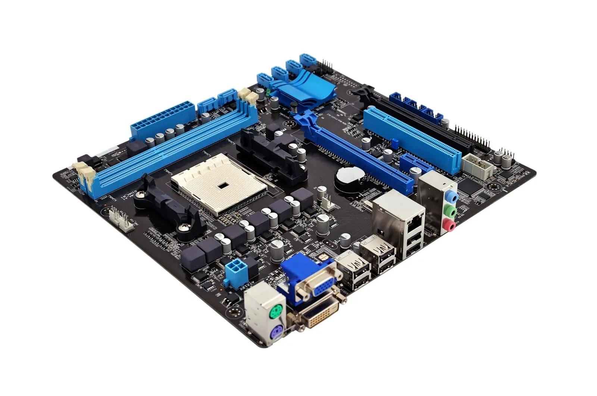
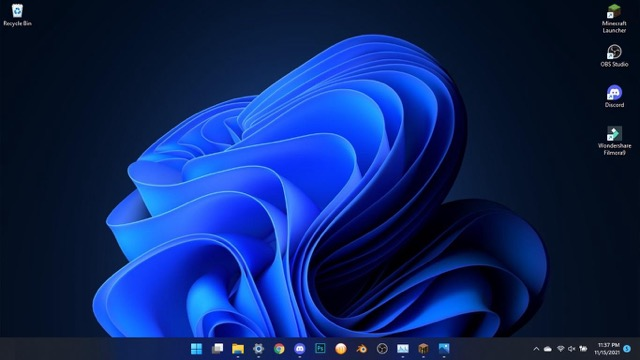
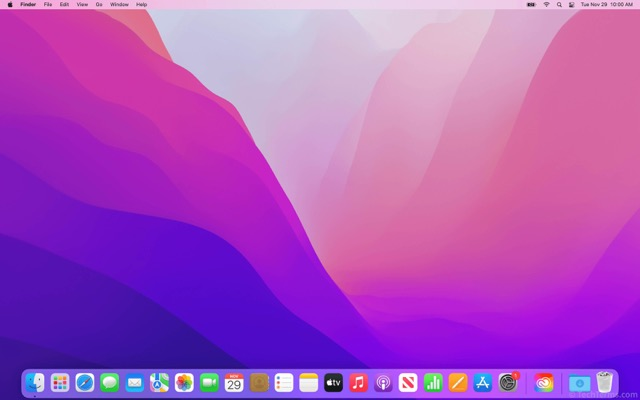
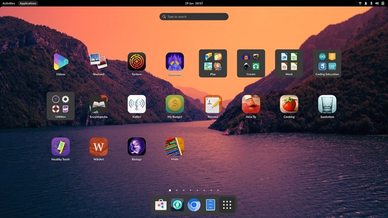

# COMPUTER HARDWARE & SOFTWARE.

## What is a Computer?

- A **Computer** is an electronic device that accepts user **input** (data) and **processes** it under the influence of a set of instructions referred to as programs to produce the desired **output** generally referred to as information (Mugivane, 2014).

### Basic Functionalities of Computers

- A computer must have all of the different components that enables a computer to _take input_, _process data_, _present outputs_, and _store information_.

| INPUTS                                                      | PROCESS                                                                                 | OUTPUTS                                                                                                                            | STORAGE                                                                    |
| ----------------------------------------------------------- | --------------------------------------------------------------------------------------- | ---------------------------------------------------------------------------------------------------------------------------------- | -------------------------------------------------------------------------- |
| These are **data** given to the computer system from a user | **Processes** the data and converts it into useful information for the computer to use. | Once inputs have been processed, and now are ready to be **presented** to the user, the information will be outputted to the user. | Stores the **data/instructions** in its memory and use them when required. |

## Computer Hardware

- The **Computer Hardware** is a component of a computer system that which provides the physical mechanisms to input and output data, to manipulate and process data, and to electronically control the various input, output, and storage components (Englander, 2010).

### Types of Computer Hardware

#### Internal Computer Hardware

- These primary parts of a component that affects its performance and functionality. These are components that are necessary for a computer to function.

| Motherboard                                                                                                                                                                                                  |
| ------------------------------------------------------------------------------------------------------------------------------------------------------------------------------------------------------------ |
|                                                                                                                                                               |
| Often called the **mainboard** or **system board**, it is the _main circuit board for the computer system_. Every device in the computer system will either be _part of the motherboard or connected to it._ |

| Processor (CPU)                                                                                                                                                                                                                                      |
| ---------------------------------------------------------------------------------------------------------------------------------------------------------------------------------------------------------------------------------------------------- |
|                                                                                                                                                                                                                 |
| The processor’s function is to _control the activities of the computer system_. A computer program is made up of instructions and when the program is run, the processor is _responsible for carrying out these instructions in an orderly fashion_. |

#### External Computer Hardware

- **External Computer Hardware** or **Peripherals** are devices connected to computers to enhance its usability and expand its functions.

| Mouse                                                                                                                                                                      |
| -------------------------------------------------------------------------------------------------------------------------------------------------------------------------- |
|                                                                                                                                   |
| A **Mouse** is a hand-held pointing device that moves a cursor around a computer screen and _enables interaction with objects on the screen_. It may be wired or wireless. |

| Keyboard                                                                                                               |
| ---------------------------------------------------------------------------------------------------------------------- |
|                                                                         |
| A **Keyboard** is a type of external computer hardware component that _adds more buttons for shortcuts or text entry_. |

## Computer Software

- These are _set of instructions_ that control the operation of the computer and its devices.
- **Software** tells the computer what to do. It refers to the various computer programs that _controls the way a computer operates_.
- A **program** is a _set of instructions arranged in a logical way_ that a computer can run.

### Types of Computer Software

| System Software                                                                                                                                                                              | Application Software                                                                                                                                                                                   |
| -------------------------------------------------------------------------------------------------------------------------------------------------------------------------------------------- | ------------------------------------------------------------------------------------------------------------------------------------------------------------------------------------------------------ |
| This type of software that _manages and operates computer hardware_, providing a platform for other software. Examples include **operating systems**, **device drivers**, and **utilities**. | This type of software is designed to _help users perform specific activities or solve particular problems_. Examples include **productivity tools**, **media players**, and **business applications**. |

### Categories of System Software

| Operating System (OS)                                            | Programming Languages                                                               | Utility Programs            |
| ---------------------------------------------------------------- | ----------------------------------------------------------------------------------- | --------------------------- |
| Provides basic working environment/user interface on a computer. | Is a set of grammatical rules for instructing a computer to perform specific tasks. | Diagnose computer problems. |
| To control loading and running of application programs.          | It is what allows humans to communicate to computers to create programs.            | Performs tasks on files.    |

#### Examples of Common Operating Systems (OS)

| Windows                                                                                                                                                                                                                                        |
| ---------------------------------------------------------------------------------------------------------------------------------------------------------------------------------------------------------------------------------------------- |
|                                                                                                                                                                                                  |
| A widely used operating system developed by **Microsoft**, known for its _user-friendly interface and compatibility with a large range of software applications_. It’s commonly used in personal computers, business environments, and gaming. |

| MacOS                                                                                                                                                                                 |
| ------------------------------------------------------------------------------------------------------------------------------------------------------------------------------------- |
|                                                                                                                                             |
| An operating system created by **Apple**, specifically for Mac computers. It’s known for its sleek design, robust security, and seamless integration with Apple devices and services. |

| Linux                                                                                                                                                                                             |
| ------------------------------------------------------------------------------------------------------------------------------------------------------------------------------------------------- |
|                                                                                                                                                         |
| An **open-source operating system** known for its flexibility, security, and customization options. It’s popular among developers, IT professionals, and for use in servers and embedded systems. |

#### Examples of Common Programming Languages

- **C** - A powerful general-purpose language developed at Bell Laboratories.
- **Python** - is a general-purpose language created in the early 1990s. It has become _popular in business and academic applications_.
- **JavaScript** - created in the 1990s, _are used in web pages_. Despite its name, JavaScript is not related to Java.

#### Examples of Common Utility Softwares

- **File Manager** - is a utility that performs functions related to **file management**, such as _displaying a list of files in folders, copying, renaming, deleting, moving, and sorting files or folders_.
- **Firewall** - is a utility that _detects and protects a personal computer from unauthorized intrusions_, monitoring all transmissions to and from a computer.
- **Media Player** - is a utility that allows you to _view images and animation, listen to audio, and watch video files_.
- **Anti-Virus** - is a utility that _protects a computer against viruses_ by identifying and removing any computer viruses found in memory, storage, or incoming files.

#### Examples of Common Application Softwares

- **Word Processing Software** - _aids users in creating business and personal documents_, such as letters, reports, memos, and etc.
- **Spreadsheet Software** - _aids users in creating worksheets that perform calculations_ on financial and statistical data.
- **Presentation Software** - _aid users in creating graphical slides_ to support presentations.
- **Internet Browsers** - are used primarily for _displaying and accessing websites on the Internet_, as well as other content available in the internet

## Implementation of Computers in the Community

- **Computer Hardware** and **Software** play vital roles across different institutions and fields in the community due to their abilities in improving efficiency and ultimately enhancing the quality of service (Kejawa, 2016).

### Education

**Computers** contribute greatly in the **field of education** in schools and universities by:

- Allowing students to store and access lessons which _enables them to review and revisit material when needed_.
- Allowing learners to efficiently access millions of information through the **Internet**.
- The concept of smart classes and e-books are only possible because of computers.
- Instructors and Teachers and aided by computers which allow them to **efficiently complete tasks**.

### Healthcare

**Computers** contribute greatly in the **field of medicine and healthcare** in hospitals and medical facilities by:

- _Allowing patients to efficiently book appointments_ and _allow the employees to make files for patients with ease_.
- The preservation of patient information allows medical practitioners to _easily access patient’s file_ allowing them to efficiently track patient records and health development.
- Allowing medical practitioners to efficiently complete tasks through advanced Diagnostic and Treatment Tools. Tools likes the MRI and CT scanners _improve the accuracy and speed of diagnosis_.

### Entertainment

**Computers** contribute greatly in the **industry of entertainment** by:

- _Allowing users to easily play fun games, listen to music, and watch movies or videos_ with digital distributions platforms such as **Netflix**, **Youtube**, and **Spotify**.
- The advancement of computers and technology has _enabled modern entertainment products to maximize consumer experience_.
- _Computers enable the development of social media platforms and interactive content_, fostering communities and user-geneted entertainment.

### Business

**Computers** contribute greatly the **field and industry of businesses** by:

- _Allowing mass production and automation by factories_ which heavily rely on computers to operate machines and equipment in order to ensure a high level of quality in production.
- _Computers allow fast calculations, data storage, and analysis, streamlining business operations_. Software tools for data analysis and presentations enable businesses make informed decisions, track performance, and optimize processes.
- _Supporting companies through digital marketing_ which enables them to easily spread products and services to many users.

## Reaction/Analysis

Computers have revolutionize the daily lives of humans. From improving all processes of work in the field of business to improving the quality of education. Moreover, computers have also improved communication. Technology has been made simpler in daily life to solve complex tasks that will otherwise take more time to achieve. They also reduce the mistakes that humans commit while calculating ensuring that the solutions they provide are accurate and reliable most importantly in areas like health care and engineering. They also provide knowledge to a broad range of people for the purpose of learning, innovating, and thinking. Considering computers play a vital role in our lives, it is also important to study and learn how and why they work.

Two important components of the computers are the hardware and the software. Hardware refers to the physical elements of a computer, among which are a processor, memory, and storage devices together working to process and store data. The processor is essentially the brain of a computer, carrying out the execution of instructions at incredibly high speeds. On the contrary, software refers to programs and applications that give out instructions to the hardware regarding what to do. The operating system is the most fundamental software layer: that is, either like Windows or macOS, it represents the core for managing resources on hardware while running other software. Applications enable users to perform a variety of tasks, from browsing the internet to efficiently complete tasks.

In conclusion, computers have fundamentally changed the way we live, work, and connect. As technology continues to evolve, understanding how computers function and mastering their use becomes increasingly essential. Embracing this knowledge empowers us to harness their full potential in our personal and professional lives.

## References

- Al MUSTAQBAL UNIVERSITY. (n.d.). Computer Hardware. https://tinyurl.com/4696s9sc
- Allaurio. (2019, August 16). Types of application software. Scribd. https://tinyurl.com/2km2r7dc
- Basil. (2021, October 16). Internal and external components of computer. Scribd. https://tinyurl.com/3wrvdv6z
- Bulman, G., & Farilie, R. (n.d.). Technology and Education: Computers, Software, and the Internet.
- Dalida, R. (2017, August 6). Types of hardware and function. Scribd. https://tinyurl.com/26ucy5fw
- Englander, I. (2010). The architecture of computer hardware, system software, and networking: An information technology approach. Wiley.
- Gill, S. (n.d.). Impacts of Computers on Today’s Society. In International Journal of Core Engineering and Management (IJCEM) (Vol. 2, Ser. 1). essay. Retrieved November 9, 2024, from https://tinyurl.com/36zjj269.
- Haidar, A. (n.d.). COMPUTERS IN OUR DAILY LIFE. In International Journal of Computer Science and Information Technology Research (Vol. 9, Ser. 2, pp. 11–17). essay. Retrieved November 9, 2024, from https://tinyurl.com/2wannh8u.
- Kejawa, I. (2016). Computer in Society: The World of Science and Technology.
- Mohamed, M. S. (2023, November 29). Hardware book bti.pdf. SlideShare. https://tinyurl.com/mt7t3a5k
- Mugivane, F. (2014). Introduction to Computer.
- Pearson Higher Education. (n.d.). In Introduction to Computers and Programming. essay. Retrieved November 9, 2024, from https://tinyurl.com/34jjwhh3.
- Semantic Scholar. (n.d.). Utility programs - semantic scholar. Utility Programs. https://tinyurl.com/mr33u92j
- Shah, J. (2020, April 26). Application software notes. Scribd. https://tinyurl.com/y2jn9j67
- Stjoseph-Naggalama. (n.d.). COMPUTER SOFTWARE. https://tinyurl.com/yjjbxmpb
- Tonny, O. (2019, August 8). Computer software. Scribd. https://tinyurl.com/msxdfdta
- Varghese, D. (2020, November 20). Use of computers in hospital and community. Scribd. https://tinyurl.com/2v7rs9yf
- Viva College School. (n.d.). Topic 3: Computer software. TOPIC 3: COMPUTER SOFTWARE. https://tinyurl.com/4zjxsxp8
- Wang, M. (2020, November 27). Topic D: Common uses of computers in society. Key Concepts of Computer Studies. https://tinyurl.com/2d9uum5u
