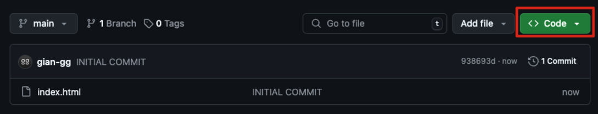

# HOW TO HOST IN DCISM.ORG

Hosting static pages using vanilla web development technologies (HTML, CSS, JavaScript) on **DCISM.ORG** involves several key steps to ensure the pages are properly deployed and accessible. Here’s a detailed guide to help you through the process:

## 1. Go to **GitHub.com**

While there are various methods to accomplish this, using GitHub for this guide introduces you to an essential tool that is invaluable for your journey in Computer Science. Woa thank you chatgpt for this awesome statement.

### A. Create a GitHub Repository

### B. Fill in the Repository Details

### C. Upload Files Manually

- **Important Note**: Make sure to upload the _files_, and not a folder that contains the files.
- **Important Note**: Make sure have the _index.html_ on the root directory of your project.

### D. Access Repository Link

- This will be important later.
  
  

## 2. Go to **admin.dcism.org**

- Login using your DCISM credentials.

### A. Go to the Subdomain Tab

### B. Add a Subdomain

- **Important Note**: Add a subdomain, u can add any subdomain name u want. All subdomains must be unique, it will prompt you if enter a subdomain that has already been claimed.
  

### C. Go to SSH Tab

### D. Copy SSH Command

- After Enabling SSH, copy the command.
  

## 3. Go to a Terminal

- Open a terminal on your computer (e.g., Command Prompt or PowerShell for Windows, or Terminal for Linux and macOS)

### A. Paste in Command

- Paste the SSH Command from **admin.dcism.org** in the terminal line.

### B. Login using your DCISM credentials

- After pasting the command, the terminal will prompt for a password.

### C. Locate your Subdomain

- To locate your new subdomain, run the command:

> cd {subdomain_name}.dcism.org

- Example: `cd epanto.dcism.org`

### D. Clone your GitHub Repository

- To upload your website's files, clone your GitHub repository by running the command:

> git clone {https_link} .

- Example: `git clone git@github.com:gian-gg/test.git .`
- **Important Note**: Make sure to include the _dot_ at the end of the command.

### E. Complete

- After successfully cloning your Github Repository, the website should now be successfully deployed.
- You can access your website in : `{subdomain_name}.dcism.org`

## 4. Updates

- If you want to update website:
  - Upload the updated files in your GitHub repository
  - Run Command: `git pull origin main`
